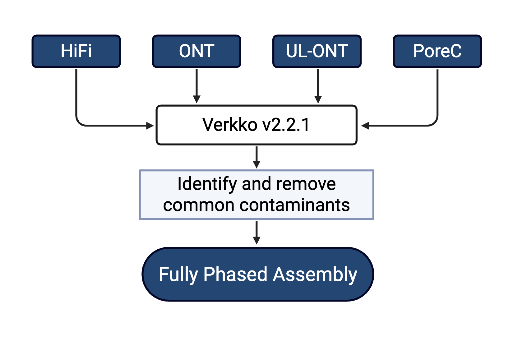

This is a section for the DSA and phasing analysis of the SMaHT (Somatic Mosaicism across Human Tissues) MEI (Mobile Element Insertion) Benchmarking project by the effort from the SMaHT MEI Working Group.

### Command lines

* DSA construction: 
  <p align="center">
    <a href="./BL2009_Pipeline.png">
      
    </a>
  </p>
  Verkko:
  
  ```
  verkko -d verkko --threads 20 --hifi SRR28305169/SRR28305169.fastq --nano SRR31537472/SRR31537472.fastq SRR28305170/SRR28305170.fastq --porec SRR31537471/SRR31537471.fastq --unitig-abundance 4
  ```
  
  Decontamination:
  ```
  
  ```
* For liftover from hg38 to DSA, or DSA to hg38, please check the scripts in folder `REFtoDSA.liftover`.


### Tools for Haplotype phasing and DSA 

* LRPhasing: https://github.com/wjhlang/LRPhasing
* PhaseBlockExtension: https://github.com/wjhlang/PhaseBlockExtension 

## Citation 
* Wang et al., [Multi-platform framework for tracing low-frequency mosaic somatic retrotransposition in human tissues](), bioxriv, 2025, ``
* Wang et al., [Enhancing haplotype-resolved donor-specific assemblies with orthogonal bridging facilitates somatic variant calling](), bioxriv, 2025, ``
