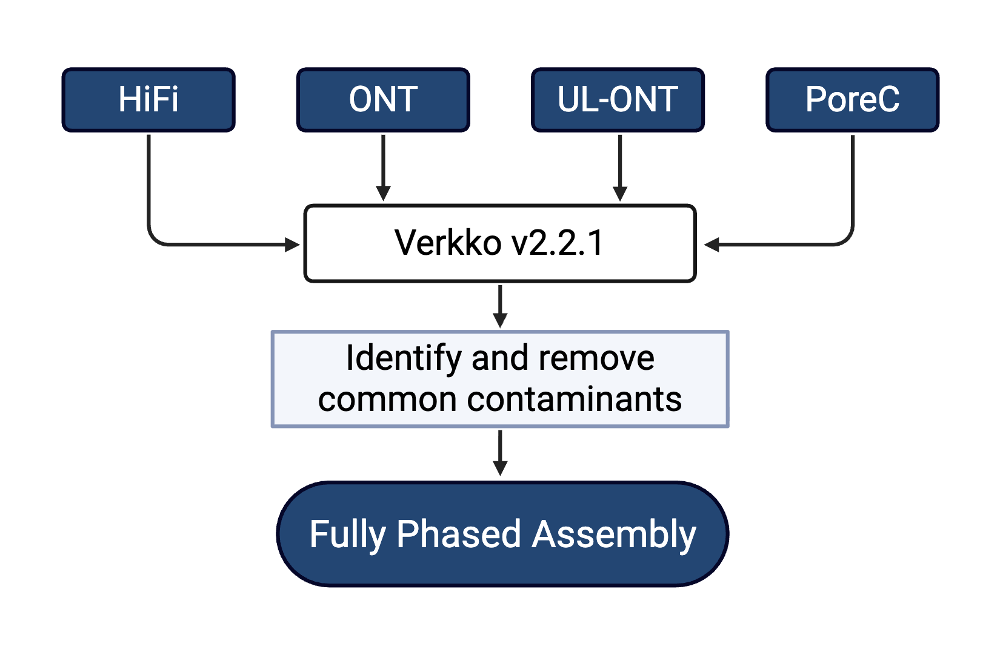

This is a section for the DSA and phasing analysis of the SMaHT (Somatic Mosaicism across Human Tissues) MEI (Mobile Element Insertion) Benchmarking project by the effort from the SMaHT MEI Working Group.

### Command lines

* DSA construction: 
  <p align="center">
    <a href="./BL2009_Pipeline.png">
      
    </a>
  </p>
  Verkko:
  
  ```
  verkko -d verkko --threads 20 --hifi SRR28305169/SRR28305169.fastq --nano SRR31537472/SRR31537472.fastq SRR28305170/SRR28305170.fastq --porec SRR31537471/SRR31537471.fastq --unitig-abundance 4
  ```
  
  Decontamination:
  ```
  bash /fcs/run_fcsadaptor.sh --fasta-input assembly.fasta --output-dir ./adapter_output --euk --container-engine singularity --image /fcs/fcs-adaptor.sif
  cat assembly.fasta | python3 /fcs/fcs.py clean genome --action-report ./adapter_output /fcs_adaptor_report.txt --output ./adapter_output/clean.fasta --contam-fasta-out ./adapter_output/contam.fasta
  python3 /fcs/fcs.py screen genome --fasta assembly.fasta --out-dir ./gx_out/ --gx-db /gx/gxdb --tax-id 9606
  cat assembly.fasta | python3 /fcs/fcs.py clean genome --action-report ./gx_out/assembly.9606.fcs_gx_report.txt --output clean.fasta --contam-fasta-out contam.fasta
  ```
* For liftover from hg38 to DSA, or DSA to hg38, please check the scripts in folder `REFtoDSA.liftover`.


### Tools for Haplotype phasing and DSA 

* LRPhasing: https://github.com/wjhlang/LRPhasing
* bridges: https://github.com/wjhlang/bridges

## Citation 
* Wang et al., [Multi-platform framework for tracing low-frequency mosaic somatic retrotransposition in human tissues](), bioxriv, 2025, ``
* Wang et al., [Enhancing haplotype-resolved donor-specific assemblies with orthogonal bridging facilitates somatic variant calling](), bioxriv, 2025, ``
